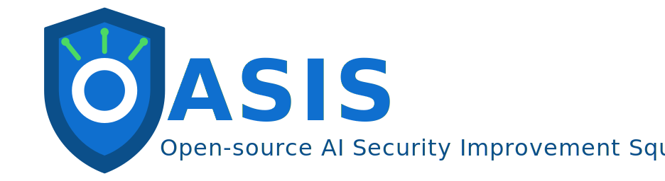
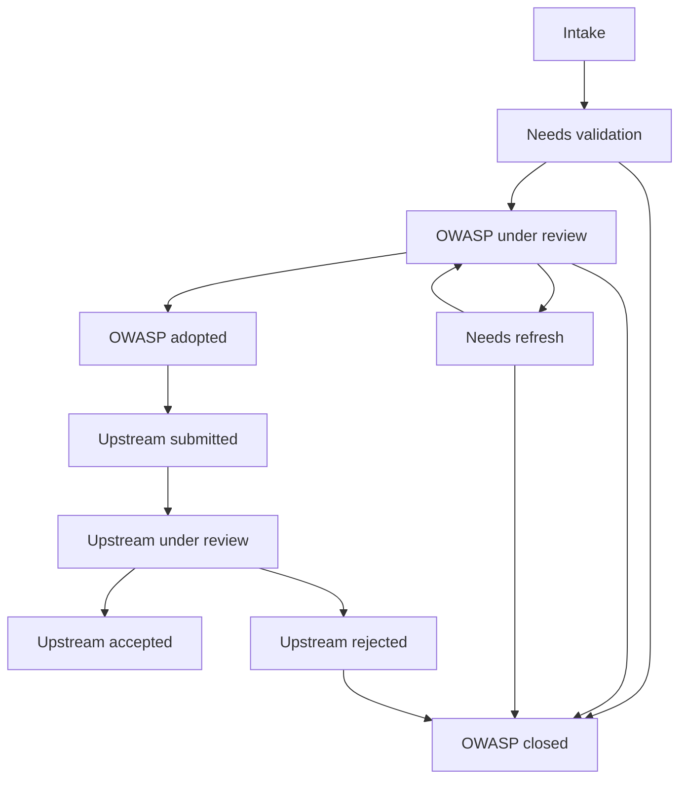

# OWASP OASIS Overview

## Purpose

OWASP OASIS is a proposed OWASP project focused on improving the security of real open-source software through a repeatable workflow:

1. Existing tools identify likely vulnerabilities and generate candidate fixes.
2. The OWASP community reviews and validates those candidate fixes.
3. Project owners decide which fixes are credible enough to upstream.
4. OWASP-adopted candidate fixes are submitted upstream as pull requests to originating open-source projects.

The goal is not to build new scanning or code-generation tools. The goal is to create a practical, community-driven operating model that turns automated findings into human-validated upstream security improvements.

*Sign up to the [mailing list](https://www.appsecai.io/oasis) to stay informed.*

## Guiding Principles

1. Focus on impact.
2. Acceptance build credibility.
3. It takes a village.

These guiding principles should be visible in the documentation, operation, and output of this project and the people who work on it together. They may be referenced simply as `Impact`, `Credibility`, and `Village` to apply contextual tags.

### This Project Will...

- Keep the authoritative review and decision process under the OWASP project. `Village`
- Treat automation as a source of candidate fixes, not as a source of truth. `Credibility`
- Require human validation before upstream submission. `Credibility`
- Use weighted reviewer credibility rather than a fixed approval count. `Credibility`
- Work on repositories where acceptance is plausible. `Impact`
- Minimize implementation effort. `Impact`

### This Project Will Not...

- Aim for raw PR volume. `Credibility`
- Wait for Opt-In. `Impact`

## Operating Model (GitHub-Centered)

The simplest implementation is a public GitHub organization or repository for OASIS with admitted members who have write or triage privileges.

GitHub is used for:

- intake of candidate fixes
- reviewer discussion and evidence collection
- validation through pull request reviews
- project tracking through GitHub Projects
- contributor identity and reputation
- audit trail for decisions

The OWASP project remains public for transparency, but only admitted members can formally review, update scores, and move candidates through the workflow.

# Operating Model
## Core Roles

### Project Owners

Project owners control governance and submission decisions. They:

- define intake criteria
- maintain reviewer credibility records
- determine whether a candidate is adopted
- decide when a fix is ready for upstream submission
- manage maintainer communication and escalation

### Validators

Validators are admitted community members who review candidate fixes. They may have different credibility levels based on experience, track record, or domain expertise.

Validators are expected to assess:

- whether the issue is real
- whether the proposed fix is correct
- whether the fix is safe for the target codebase
- whether the patch aligns with the target project's coding style and contribution norms
- whether the evidence is sufficient for upstream submission

### Maintainer Liaisons

Maintainer liaisons handle communication with upstream projects when needed. They:

- prepare the final upstream PR
- refresh the patch against the latest upstream state
- answer maintainer questions
- track acceptance, requested changes, or rejection

### Automation Operators

Automation operators run the selected scanning and fix-generation tools and package the outputs as reviewable candidate fixes.

## Target Repository Selection

`Impact`
The project should not operate as a blind mass-submission engine. Candidate repositories should be pre-screened.

Preferred targets:

- active public repositories
- recent releases or recent commits
- working CI
- documented contribution guidelines
- evidence that maintainers review external PRs
- security relevance or ecosystem importance

The project may start without formal repository opt-in. Over time, repositories that accept fixes can become preferred repeat targets, and some may eventually become explicit partner repositories.

## Candidate Fix Lifecycle

Terminology used in this lifecycle is consistent:

- tools generate candidate fixes
- humans review candidate fixes
- OWASP project owners adopt candidate fixes for upstreaming
- adopted candidate fixes are submitted upstream as pull requests
- upstream maintainers accept or reject submitted pull requests

### 1. Candidate Generation

Selected repositories are scanned using static analysis, SAST, dependency analysis, and LLM-assisted fix generation. The output is not submitted upstream directly.

Each candidate fix should be tied to:

- target repository
- upstream base commit SHA
- vulnerability category or hypothesis
- generated patch or branch
- reproduction notes if available
- test evidence if available
- tool provenance

### 2. OWASP Intake

Each generated candidate is entered into the OWASP OASIS GitHub workflow as a tracked item. The initial record should include:

- a summary of the issue
- the proposed fix
- affected repository and base commit
- severity or urgency estimate
- links to evidence
- current status in the queue

At this stage the item is an OWASP candidate, not an upstream submission.

### 3. Internal Validation

Validators review the candidate inside the OWASP workflow. Review may happen on a PR in an OWASP-controlled fork or branch, or on a candidate artifact linked from an issue.

Validators leave structured feedback on:

- issue validity
- patch correctness
- exploitability or urgency
- regression risk
- repo fit
- confidence level

Multiple validators can review the same candidate. Their reviews are not all treated equally.

Validation timing should be explicitly tracked for each reviewer action:

- check-out timestamp when a validator begins active review
- check-in timestamp when a validator submits a decision
- elapsed review time for that validation cycle

Each validator decision should be recorded as one of:

- accept
- reject
- modify

These timing and outcome records support both operational metrics and reviewer credibility scoring over time.

### 4. Weighted Validation Scoring

The project uses a weighted validation model rather than a fixed "two approvals" gate.

Project owners consider:

- number of validators supporting the fix
- credibility level of each validator
- track record of previous accurate reviews
- subject-matter expertise
- severity and urgency of the issue
- expected likelihood of upstream acceptance
- quality of supporting evidence

This model allows the project to distinguish between:

- a low-severity fix with broad but shallow support
- a high-severity fix supported by a smaller number of highly credible reviewers

The score is advisory, not fully automatic. Final upstream acceptance remains a decision by the upstream repository maintainers or their delegated contribution rules.

## Repository and Branch Strategy

The project should avoid maintaining long-lived forks for every target repository.

Recommended approach: ephemeral working forks.

Workflow:

1. Keep the canonical queue, status, and validation history in the OWASP GitHub project.
2. Create a fork or working branch only when a candidate enters active validation or is selected for upstreaming.
3. Tie every candidate to a specific upstream commit SHA.
4. Before upstream submission, refresh the fix against the latest upstream default branch.
5. If upstream has moved materially, return the candidate to a refresh state and rerun validation as needed.

This keeps the project lightweight and reduces branch drift, stale forks, and maintenance overhead.

## Upstream Submission Decision

Project owners decide whether a candidate is:

- adopted for upstream submission
- held for more review
- returned for refresh or rewrite
- closed as invalid or too weak

A candidate should be adopted only when:

- the issue appears real
- the fix is technically sound
- the patch is credible to maintainers
- the target repository is still active and submission-worthy
- the validation record is strong enough to justify OWASP sponsorship

## Upstream Submission

Once OWASP adopts a candidate fix for submission:

1. A maintainer-facing PR with description is prepared.
2. The upstream PR is opened from the working fork.
3. Maintainer liaison activity may be tracked until the upstream PR is accepted/merged, revised, or rejected.

The upstream submission should clearly communicate that the fix was human-reviewed through the OWASP workflow (provide all stats of reviewers, etc) rather than blindly generated.

# Project Strategy

## Metrics

The project should emphasize practical outcome metrics, rather than only activity metrics.

Recommended metrics:

- candidate fixes generated
- candidate fixes reviewed
- candidate fixes adopted by OWASP
- upstream PRs submitted
- upstream PRs accepted
- time to first maintainer response
- time from intake to upstream submission
- acceptance rate by repository
- acceptance rate by issue category
- validator participation and accuracy over time
- time to decision for each PR review per user
- classification of pr by CWE and other details

The most important leading metric is likely OWASP submission quality. The most important lagging metric is upstream acceptance rate.

## Minimal GitHub Information Architecture

To avoid custom implementation, the project can start with:

- one public OWASP OASIS repository
- one GitHub Project for queue and status tracking
- issue templates for candidate fixes and validation records
- pull requests for candidate review where useful
- labels for severity, language, repository, status, and issue type
- a protected validator-credibility file such as `validators.yml`
- `CODEOWNERS` rules so only project owners can approve changes to scoring criteria or validator weights

Suggested workflow states:

- Intake
- Needs validation
- OWASP under review
- Needs refresh
- OWASP adopted
- Upstream submitted
- Upstream under review
- Upstream accepted
- Upstream rejected
- OWASP closed

## Workshop Kickoff Model

The project can begin with a workshop in which selected repositories are pre-scanned and candidate fixes are prepared in advance.

Workshop participants:

- review candidates
- validate issues
- improve weak fixes
- learn the OASIS workflow
- help identify which submissions are credible enough to upstream

This creates an initial backlog, trains contributors, and establishes a repeatable operating model before the project moves into continuous operation.

## Recommended Initial Version

The simplest practical launch version is:

1. Public OWASP GitHub repo and GitHub Project.
2. Pre-screened target repositories, but no formal opt-in requirement.
3. Candidate fixes tracked as GitHub issues, with OWASP review happening on linked branches or PRs when needed.
4. Weighted validation recorded by admitted reviewers.
5. Final adoption decisions made by project owners.
6. Ephemeral forks used only for active review and upstream submission.
7. Success measured primarily by upstream acceptance rate and maintainer responsiveness.

This version is simple enough to start quickly, public enough to build community visibility, and structured enough to preserve credibility with upstream maintainers.

## Open Design Questions

The following choices still need to be finalized:

- whether validation artifacts should be issues, PRs, or both
- how reviewer credibility levels are assigned and updated
- whether weighted scores are maintained manually or via GitHub Actions
- how public the candidate queue should be before adoption
- whether some vulnerability categories require higher review thresholds
- how maintainers are approached for sensitive or embargoed issues