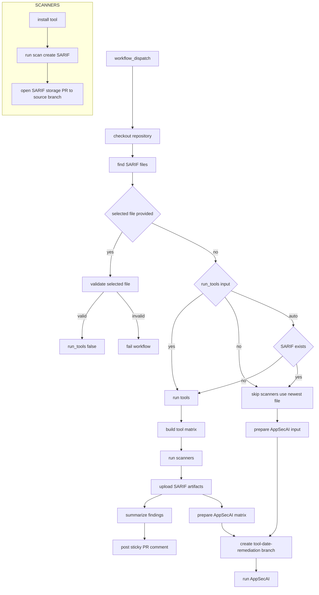

# 🛡️ Scan, Triage, & Remediation Workflow — Summary & Features

This GitHub Actions workflow automates a **full security scanning pipeline** with support for multiple tools, SARIF output, PR comments, and AppSecAI integration. It is designed for repeatable, auditable, and user‑controlled security scanning.

---

## Workflow Chart


## 🚀 What This Workflow Does

### **1. User‑Controlled Execution**
The workflow is triggered manually via `workflow_dispatch` and allows the user to choose:
- Whether to run scanners again (`auto`, `yes`, `no`)
- Which tools to run (`semgrep`, `bandit`, or both)
- Which SARIF file to use if not running scanners

This gives you **full control** over how and when scans run.

---

## 📁 2. SARIF File Management & Validation
The workflow:
- Stores all scan results under `scan-results/`
- Names files using the pattern:  
  ```
  <tool>-YYYYMMDD-HHMMSS.sarif
  ```
- Validates user‑selected SARIF files  
- Automatically selects the **newest SARIF file** when needed  
- Uploads generated SARIF files as workflow artifacts for downstream jobs
- Opens a dedicated PR to store each generated SARIF file back into the repository
- Targets the SARIF storage PR at the same branch that triggered the workflow run

This keeps scan output auditable without pushing directly onto the branch that launched the action.

---

## 🧪 3. Dynamic Tool Execution (Matrix)
The workflow builds a **dynamic matrix** based on the user’s selected tools.

Example:
```
semgrep,bandit
```

Only those tools run.  
Each tool:
- Installs itself
- Runs a scan
- Produces SARIF output
- Uploads its SARIF file as an artifact for later jobs
- Opens a PR that stores that SARIF file against the triggering branch

This keeps the workflow **modular, auditable, and safe for multi-tool runs**.

---

## 📝 4. Automatic PR Comments
After scans complete, the workflow posts a **sticky PR comment** summarizing:
- Which tools ran
- How many findings each tool produced
- Where the SARIF files are stored
- A note that the results were generated by the GitHub Action

This gives reviewers immediate visibility into security findings.

---

## 🤖 5. AppSecAI Integration
Before running AppSecAI, the workflow creates a remediation branch in this format:

```
<tool>-YYYY-MM-DD-remediation
```

The tool name is taken from the matrix job when scanners run, or derived from the selected SARIF filename when an existing file is used.

The workflow then:
- Selects the correct SARIF file for each tool run, or uses the validated existing file
- Checks out the source branch that triggered the workflow
- Creates and pushes the remediation branch before invoking AppSecAI
- Runs AppSecAI from that remediation branch so remediation PRs are tied to the correct branch name

This creates a **complete end-to-end security pipeline** with deterministic remediation branch naming.

---

# 🧩 Template for Adding New Tools

Below is a **drop‑in template** you can use to add new scanners that output SARIF.

### **Step 1 — Add the tool to the `tool_pack` input**
Example:
```
semgrep,bandit,mytool
```

---

### **Step 2 — Add install logic**

Inside the `Install tools` step:

```bash
if [[ "${{ matrix.tool }}" == "mytool" ]]; then
  # Install your tool here
  pip install mytool
fi
```

---

### **Step 3 — Add scan logic**

Inside the `Run scanner` step:

```bash
if [[ "${{ matrix.tool }}" == "mytool" ]]; then
  mytool scan --format sarif --output "$outfile" .
fi
```

**Requirements:**
- Must output SARIF
- Must write to `$outfile`

---

### **Step 4 — Add summary logic**

Inside the summary step:

```bash
for f in sarif-*/*.sarif; do
  tool=$(basename "$f" | cut -d'-' -f1)
  count=$(jq '.runs[].results | length' "$f")
  echo "- **$tool** → $count findings" >> $GITHUB_OUTPUT
done
```

This automatically includes your new tool.

---

### **Step 5 — Done**
No other changes needed.
The matrix, SARIF artifact handoff, storage PR logic, PR comments, and AppSecAI remediation branch creation all work automatically.

---

# 🧱 Example: Adding a New Tool (Hypothetical “SecureScan”)

### 1. Update tool pack input:
```
semgrep,bandit,securescan
```

### 2. Add install logic:
```bash
elif [[ "${{ matrix.tool }}" == "securescan" ]]; then
  curl -L https://example.com/install.sh | bash
```

### 3. Add scan logic:
```bash
elif [[ "${{ matrix.tool }}" == "securescan" ]]; then
  securescan analyze --sarif "$outfile"
```

That’s it — the workflow handles everything else.
